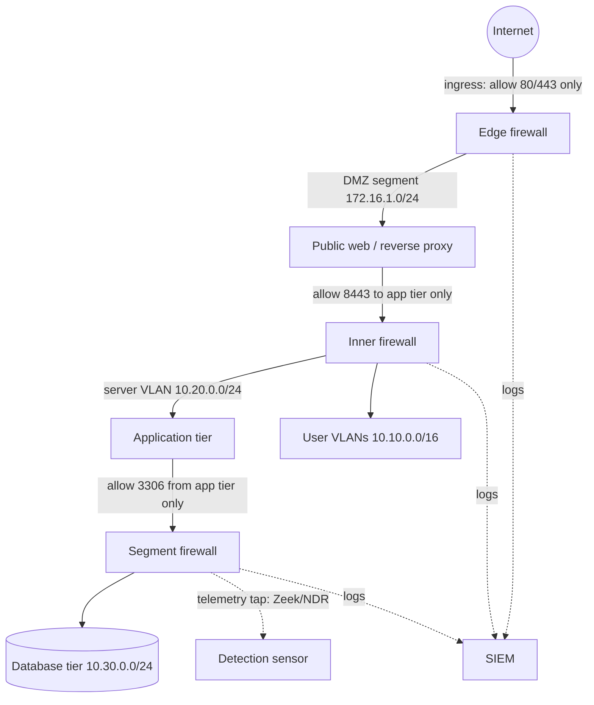

# Diagram — Enterprise Segmentation Architecture

> **Conceptual reference model — not an exact production configuration.**
> Zone names, addressing, and product placement vary per organization.



ASCII ground truth:

```
                    ┌──────────────┐
                    │   INTERNET   │
                    └──────┬───────┘
              allow 80/443 │
                    ┌──────▼───────┐      logs      ┌────────┐
                    │ EDGE FIREWALL│───────────────►│  SIEM  │
                    └──────┬───────┘                └────────┘
                           │  DMZ 172.16.1.0/24
                    ┌──────▼───────┐
                    │  PUBLIC WEB  │  (reverse proxy, no data)
                    └──────┬───────┘
              allow 8443   │
                    ┌──────▼───────┐      tap         ┌────────┐
                    │INNER FIREWALL│·················►│  ZEEK  │
                    └──────┬───────┘  (server VLAN)  └────────┘
             ┌─────────────┼──────────────┐
             │ 10.10.0.0/16│ 10.20.0.0/24 │
      ┌──────▼─────┐ ┌─────▼──────┐ ┌─────▼──────┐
      │ USER VLANs │ │  APP TIER  │ │ SEGMENT FW │──allow 3306──► DB TIER
      └────────────┘ └────────────┘ └────────────┘      10.30.0.0/24
```

**Text description (accessibility):** the internet reaches only the edge
firewall, which admits web ports into a DMZ holding a reverse proxy. The
proxy is the only host allowed to start connections into the application
tier through the inner firewall; user VLANs sit behind the same inner
firewall; the database tier is reachable only from the application tier
on its service port. Every firewall forwards logs to the SIEM, and a
Zeek sensor taps the server-VLAN span port.
