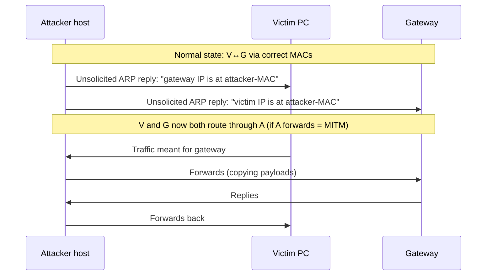

# Diagram — ARP Poisoning Flow & DAI Defense

> Attack mechanics shown **conceptually for defense teaching**; no tool
> names or commands. Pair with cs-003/cs-013 evidence analysis.



Defense sequence (the same wires, defended):

```
 SWITCH with Dynamic ARP Inspection
   ├─ DHCP snooping builds IP↔MAC binding table (trusted ports only)
   ├─ ARP replies on UNTRUSTED ports checked against bindings
   ├─ mismatch → frame DROPPED + logged (the attack above dies here)
   └─ no binding → drop (no exceptions without static entries)
```

ASCII ground truth (the poisoning):

```
  VICTIM                ATTACKER               GATEWAY
    │  fake ARP:          │                       │
    │ "GW is at ATK-MAC"  │                       │
    │◄────────────────────│   fake ARP:           │
    │                     │ "VICTIM is at ATK-MAC"│
    │                     ├──────────────────────►│
    │═══ V→GW traffic ═══►│═══ forwarded ════════►│   (payloads copied)
    │◄═══ GW→V traffic ═══│◄═══ forwarded ════════│
```

**Text description (accessibility):** the attacker sends unsolicited ARP
replies to both the victim and the gateway, each claiming the other's
address lives at the attacker's MAC. Both hosts update their ARP caches,
so their traffic flows through the attacker, who forwards it to stay
undetected. The switch's Dynamic ARP Inspection defeats this by
validating every ARP reply against the DHCP-snooping binding table and
dropping mismatches.
