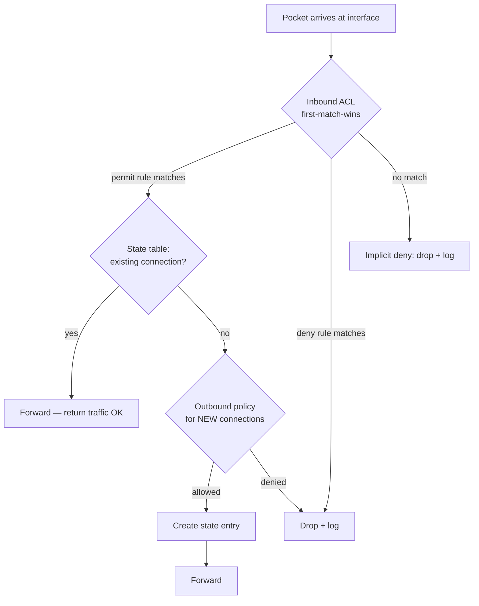

# Diagram — ACL & Stateful Firewall Decision Flow

> Vendor-neutral pseudocode; per-vendor syntax differs, decision logic
> does not.



ASCII ground truth:

```
 packet ──► [ inbound ACL: top-down first match ]
              │ permit ──► [ state table lookup ]
              │                ├─ established ──► forward
              │                └─ new ──► [ policy for new conns ]
              │                             ├─ allow ──► forward + create state
              │                             └─ deny ──► drop + log
              │ deny ──► drop + log
              └ no match ──► IMPLICIT DENY ──► drop + log

 Rule order matters (first-match):
   1. permit tcp host 10.99.0.10 any eq 22   ← jump host SSH (must be FIRST)
   2. deny   tcp any any eq 22 log           ← everyone else
   3. permit tcp any any established         ← return traffic
   (implicit deny all)
```

**Text description (accessibility):** every packet hits the inbound ACL
top-down; the first matching rule decides. Permits continue to the
state-table check: established connections forward, new connections are
evaluated by policy and (if allowed) get a state entry. Denies and
unmatched packets drop with a log line. The worked rule list shows why
the jump-host permit must precede the deny rule.
