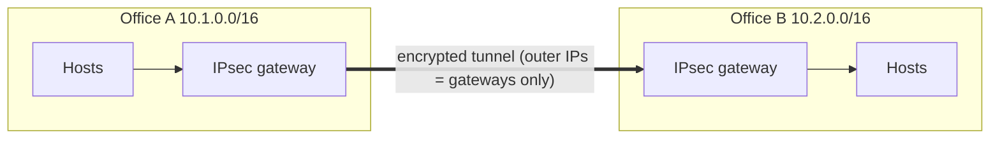

# Diagram — VPN Concepts: Site-to-Site IPsec & Remote Access

> Conceptual only — gateway models, selector details, and crypto suites
> vary by deployment.



Remote access (the trust-boundary story):

```
 REMOTE WORKER                       CORPORATE EDGE
 ┌─────────────┐  full-tunnel VPN   ┌───────────────┐
 │ Laptop      │═══════════════════►│ VPN gateway   │──► internal nets
 │ (managed?)  │◄───────────────────│ + MFA + MFA   │
 └─────────────┘   split-tunnel:   └───────────────┘
       │ only corporate ranges tunnel         ▲
       └──► local LAN stays OUTSIDE the tunnel  │ risk: unmanaged device
            (the local untrusted network still  │ bridges into the session
             shares the device's trust path) ───┘
```

IPsec site-to-site packet story:

```
 Inner packet:  [ IP src=10.1.5.7 dst=10.2.9.3 | TCP 445 payload ]
 TUNNEL MODE:   [ new IP hdr: GWA→GWB | ESP: encrypted inner packet + auth ]
 Observer sees: gateways talking ESP — inner hosts/ports invisible
 Inside each site: plaintext (encryption terminates at the gateways)
```

**Text description (accessibility):** in site-to-site VPN, each site's
gateway encrypts the whole inner packet and sends it inside a new outer
packet to the peer gateway — an on-path observer sees only the gateways.
In remote access, the client tunnels to the VPN gateway: full tunnel
routes everything, split tunnel routes only corporate ranges, which
leaves the local untrusted network sharing the device's trust path —
the assignment-3 risk argument.
