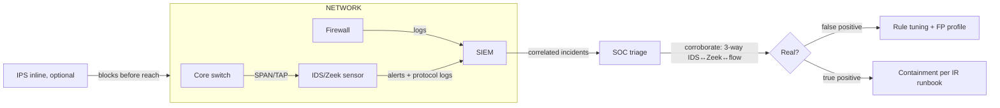

# Diagram — IDS/IPS Detection-to-Triage Workflow

> Conceptual monitoring pipeline; tap points and products vary per estate.



ASCII ground truth:

```
 [core switch] --SPAN--> [ IDS/Zeek sensor ] --alerts/logs--> [ SIEM ]
                               (observe)                       │
 [firewall] -------------logs------------------------------►   │
                                                               ▼
                                                     [ SOC triage desk ]
                                    corroborate before acting:
                                    IDS alert ↔ Zeek log ↔ flow record
                                                               │
                              ┌────────────────────────────────┤
                              ▼                                ▼
                      false positive ──► tuning task    true positive ──► IR runbook

 Inline IPS variant:  [ traffic ] ► [ IPS block/drop ] ► [ destination ]
                      (acts on packets, not just observes — latency + block risk)
```

**Text description (accessibility):** a SPAN/TAP feeds the sensor, which
sends alerts and protocol logs to the SIEM alongside firewall logs; the
SIEM correlates and hands incidents to SOC triage. Triage corroborates
across three sources before deciding; false positives feed the tuning
backlog (with their FP profile), true positives go to the IR runbook. An
inline IPS sits in the traffic path itself and can block before packets
arrive — the observation-versus-enforcement distinction the course
drills.
