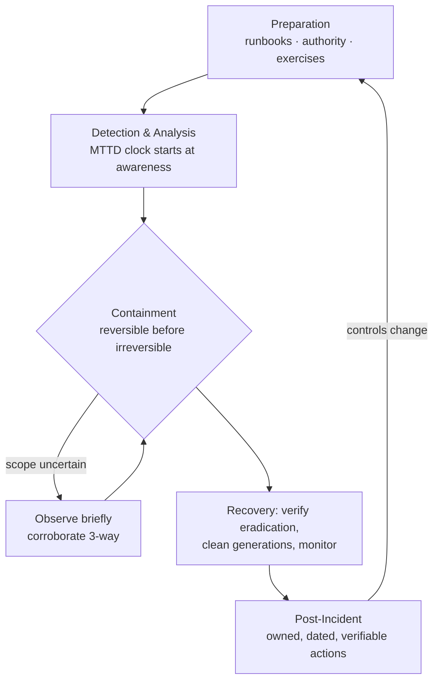

# Diagram — Incident Response Lifecycle (NIST phases, course annotations)

> Phase model per NIST SP 800-61; the reversibility loop is this course's
> teaching overlay.



ASCII ground truth (containment decision loop — the graded core):

```
                 ┌──────────────────────────────────────────┐
                 ▼                                          │
   [ Detection: alert fires ]                               │
                 │ corroborate: IDS ↔ logs ↔ flow           │
                 ▼                                          │
        ┌─ real threat? ── no ──► tuning + FP profile       │
        │ yes                                               │
        ▼                                                   │
   [ CONTAIN — order by reversibility ]                     │
        1. isolate host (reversible) ───────────────────────┤
        2. block domains (reversible)                       │ scope widens?
        3. suspend tasks, NOT delete (evidence)             │ re-corroborate
        4. rotate credentials (user cost: semi-irreversible)│
        5. rebuild/restore (irreversible — last) ───────────┘
                 │
                 ▼
   [ ERADICATE & RECOVER ] ── go/no-go board ──► [ POST-INCIDENT REVIEW ]
```

**Text description (accessibility):** the NIST loop runs preparation →
detection/analysis → containment/eradication/recovery → post-incident,
with lessons feeding back into preparation. The course's overlay is the
containment loop: every action is labeled reversible or irreversible and
ordered cheap-first; uncertain scope triggers brief observation and
re-corroboration rather than either paralysis or destructive haste.
