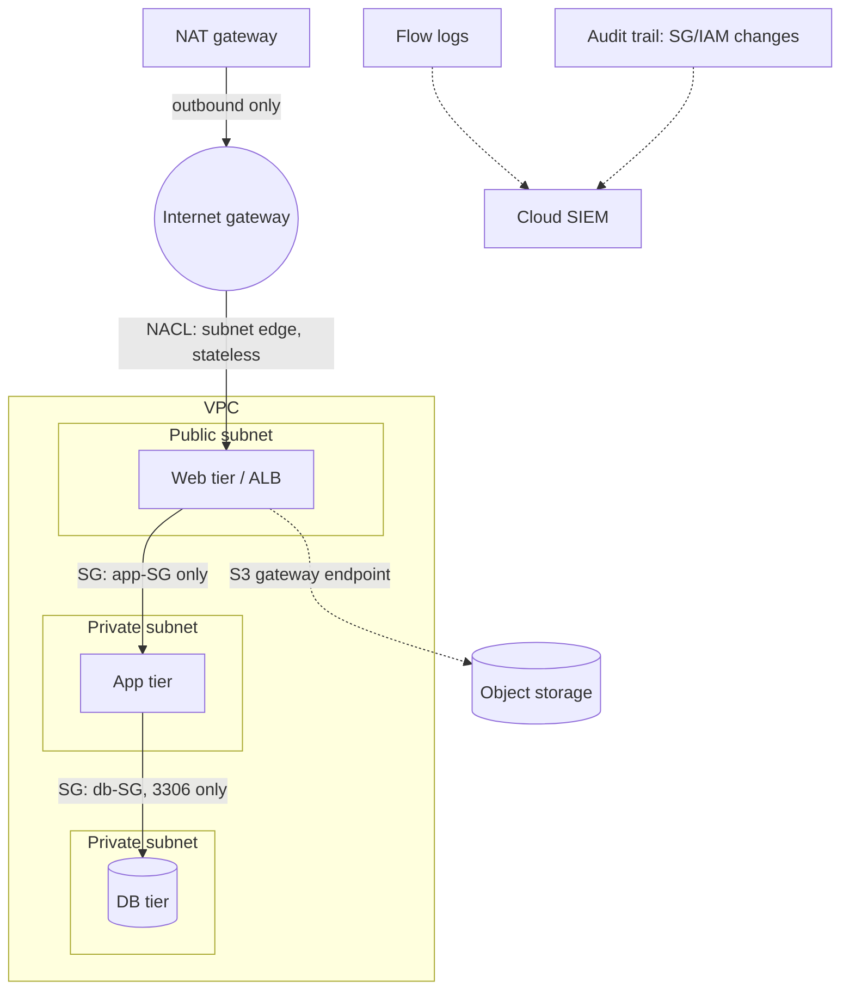

# Diagram — Cloud VPC Control Planes (SG / NACL / Route / Logs)

> Provider-neutral conceptual model; AWS/Azure/GCP naming differs, the
> control *classes* do not.



ASCII ground truth (which control acts where):

```
 INTERNET ──► [ IGW ] ──► [ NACL #1 stateless, subnet edge ]
                              │
                    ┌─────────▼─────────┐  PUBLIC SUBNET
                    │  WEB TIER + [SG1] │   SG = instance, stateful, allow-only
                    └─────────┬─────────┘
                    [ NACL #2 ]      app→db only
                    ┌─────────▼─────────┐  PRIVATE SUBNET
                    │  APP TIER + [SG2] │
                    └─────────┬─────────┘
                    [ NACL #3 ]      deny 3306 from anywhere-but-app-subnet
                    ┌─────────▼─────────┐  PRIVATE SUBNET
                    │  DB TIER  + [SG3] │  ← SG mistake cannot override
                    └───────────────────┘    the NACL deny (defense in depth)

 Visibility: FLOW LOGS (accept/reject per flow) + AUDIT TRAIL (who changed
 what) → both to the cloud SIEM; payload capture is opt-in, not default.
```

**Text description (accessibility):** internet traffic enters via the
gateway into the public subnet's web tier; security groups (stateful,
instance-attached, allow-only) constrain each tier to its dependency;
network ACLs (stateless, at the subnet edge) are the backstop — the DB
subnet's NACL denies database ports from everywhere except the app
subnet, so a permissive SG mistake alone cannot expose the database.
Flow logs and the API audit trail are the first-class telemetry; packet
capture is deliberate opt-in.
