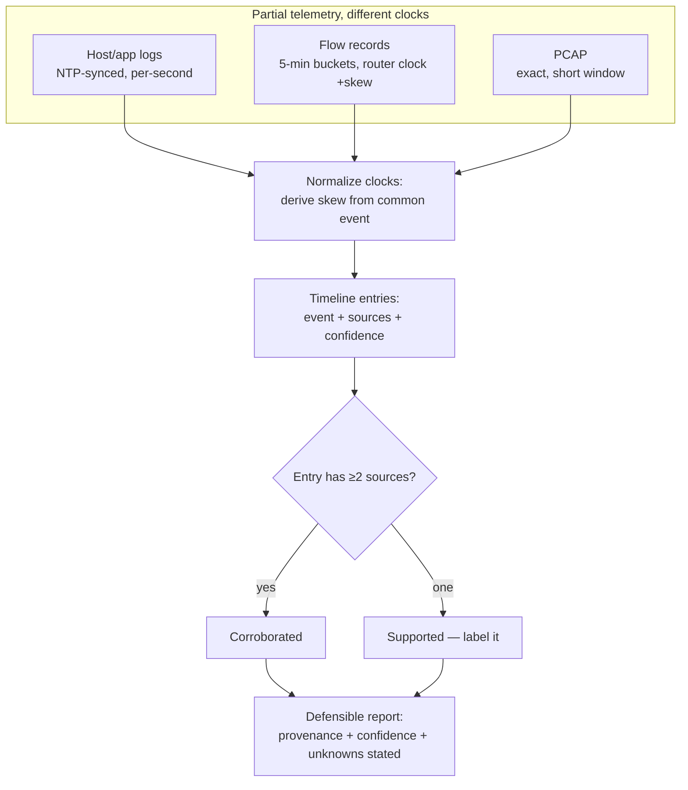

# Diagram — Multi-Source Forensic Timeline Correlation

> Methodology model; the cs-087/cs-097 cases are the worked instances.



ASCII ground truth (the correlation discipline):

```
 HOST LOGS (NTP ±50ms)      FLOW (router +3:30)      PCAP (sensor −40s)
   15:45:00 write 800 MB  ──┐   15:48 bucket 810 MB ──┐   15:44:20 session
                          ├── derive skews from ──┤   640 MB, one dst
                          │  the COMMON event      │
                          ▼                        ▼
        TIMELINE ENTRY: "bulk export 15:45–16:15, 800–810 MB, single
        TLS session to one external IP"  [3 sources → CORROBORATED]

        17:30 agent stops; flows continue to 18:05
        TIMELINE ENTRY: "590 MB egress" [flow only → SUPPORTED]
        stated as: network-attributed, host-unattributed ← the honest form
```

**Text description (accessibility):** three telemetry sources with
different clocks and granularity feed timeline construction; clock skews
are *derived* from an event visible in two sources, not assumed. Each
timeline entry records its sources and confidence — two or more sources
is corroborated, one is supported and labeled as such. The report states
unknowns explicitly (the host-blind window) instead of smoothing them,
which is what makes the timeline defensible.
